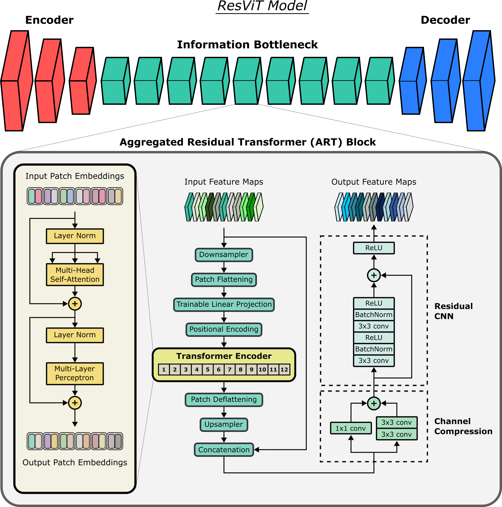

# ResViT
Official Pytorch Implementation of Residual Vision Transformers(ResViT) which is described in the [following](https://ieeexplore.ieee.org/document/9758823) paper:

O. Dalmaz, M. Yurt and T. Çukur, "ResViT: Residual Vision Transformers for Multimodal Medical Image Synthesis," in IEEE Transactions on Medical Imaging, vol. 41, no. 10, pp. 2598-2614, Oct. 2022, doi: 10.1109/TMI.2022.3167808.



## Dependencies

```
python>=3.6.9
torch>=1.7.1
torchvision>=0.8.2
visdom
dominate
scikit-image
h5py
scipy
ml_collections
cuda=>11.2
```
## Installation
- Clone this repo:
```bash
git clone https://github.com/icon-lab/ResViT
cd ResViT
```

## Download pre-trained ViT models from Google
* [Pre-trained ViT models](https://console.cloud.google.com/storage/vit_models/):
```bash
wget https://storage.googleapis.com/vit_models/imagenet21k/R50+ViT-B_16.npz &&
mkdir ../model/vit_checkpoint/imagenet21k &&
mv {MODEL_NAME}.npz ../model/vit_checkpoint/imagenet21k/R50-ViT-B_16.npz
```

## Dataset
To reproduce the results reported in the paper, we recommend the following dataset processing steps:

Sequentially select subjects from the dataset.
Apply skull-stripping to 3D volumes.
Select 2D cross-sections from each subject.
Normalize the selected 2D cross-sections before training and before metric calculation.
You should structure your aligned dataset in the following way:
```
/Datasets/BRATS/
  ├── T1_T2
  ├── T2_FLAIR
  .
  .
  ├── T1_FLAIR_T2   
```
```
/Datasets/BRATS/T2__FLAIR/
  ├── train
  ├── val  
  ├── test   
```
Note that for many-to-one tasks, source modalities should be in the Red and Green channels. (For 2 input modalities)

## Pre-training of ART blocks without the presence of transformers
It is recommended to pretrain the convolutional parts of the ResViT model before inserting transformer modules and fine-tuning. This signifcantly improves ResViT's.

For many-to-one tasks: 

<br />

```
python3 train.py --dataroot Datasets/IXI/T1_T2__PD/ --name T1_T2_PD_IXI_pre_trained --gpu_ids 0 --model resvit_many --which_model_netG res_cnn 
--which_direction AtoB --lambda_A 100 --dataset_mode aligned --norm batch --pool_size 0 --output_nc 1 --input_nc 3 --loadSize 256 --fineSize 256 
--niter 50 --niter_decay 50 --save_epoch_freq 5 --checkpoints_dir checkpoints/ --display_id 0 --lr 0.0002
```

<br />
<br />
For one-to-one tasks: <br />

```
python3 train.py --dataroot Datasets/IXI/T1_T2/ --name T1_T2_IXI_pre_trained --gpu_ids 0 --model resvit_one --which_model_netG res_cnn 
--which_direction AtoB --lambda_A 100 --dataset_mode aligned --norm batch --pool_size 0 --output_nc 1 --input_nc 1 --loadSize 256 --fineSize 256 
--niter 50 --niter_decay 50 --save_epoch_freq 5 --checkpoints_dir checkpoints/ --display_id 0 --lr 0.0002
```

<br />
<br />

## Fine tune ResViT
For many-to-one tasks: <br />

```
python3 train.py --dataroot Datasets/IXI/T1_T2__PD/ --name T1_T2_PD_IXI_resvit --gpu_ids 0 --model resvit_many --which_model_netG resvit 
--which_direction AtoB --lambda_A 100 --dataset_mode aligned --norm batch --pool_size 0 --output_nc 1 --input_nc 3 --loadSize 256 --fineSize 256 
--niter 25 --niter_decay 25 --save_epoch_freq 5 --checkpoints_dir checkpoints/ --display_id 0 --pre_trained_transformer 1 --pre_trained_resnet 1 
--pre_trained_path checkpoints/T1_T2_PD_IXI_pre_trained/latest_net_G.pth --lr 0.001
```

<br />
<br />
For one-to-one tasks: <br />

```
python3 train.py --dataroot Datasets/IXI/T1_T2/ --name T1_T2_IXI_resvit --gpu_ids 0 --model resvit_one --which_model_netG resvit 
--which_direction AtoB --lambda_A 100 --dataset_mode aligned --norm batch --pool_size 0 --output_nc 1 --input_nc 1 --loadSize 256 --fineSize 256 
--niter 25 --niter_decay 25 --save_epoch_freq 5 --checkpoints_dir checkpoints/ --display_id 0 --pre_trained_transformer 1 --pre_trained_resnet 1 
--pre_trained_path checkpoints/T1_T2_IXI_pre_trained/latest_net_G.pth --lr 0.001
```

<br />
<br />

## Testing
For many-to-one tasks: 
<br />

```
python3 test.py --dataroot Datasets/IXI/T1_T2__PD/ --name T1_T2_PD_IXI_resvit --gpu_ids 0 --model resvit_many --which_model_netG resvit 
--dataset_mode aligned --norm batch --phase test --output_nc 1 --input_nc 3 --how_many 10000 --serial_batches --fineSize 256 --loadSize 256 
--results_dir results/ --checkpoints_dir checkpoints/ --which_epoch latest
```

<br />
<br />
For one-to-one tasks: 
<br />

```
python3 test.py --dataroot Datasets/IXI/T1_T2/ --name T1_T2_IXI_resvit --gpu_ids 0 --model resvit_one --which_model_netG resvit 
--dataset_mode aligned --norm batch --phase test --output_nc 1 --input_nc 1 --how_many 10000 --serial_batches --fineSize 256 --loadSize 256 
--results_dir results/ --checkpoints_dir checkpoints/ --which_epoch latest
```
# Citation
You are encouraged to modify/distribute this code. However, please acknowledge this code and cite the paper appropriately.
```
@ARTICLE{9758823,
  author={Dalmaz, Onat and Yurt, Mahmut and Çukur, Tolga},
  journal={IEEE Transactions on Medical Imaging}, 
  title={ResViT: Residual Vision Transformers for Multimodal Medical Image Synthesis}, 
  year={2022},
  volume={41},
  number={10},
  pages={2598-2614},
  doi={10.1109/TMI.2022.3167808}}
```
For any questions, comments and contributions, please contact Onat Dalmaz (onat[at]ee.bilkent.edu.tr) <br />

(c) ICON Lab 2021

## Acknowledgments
This code uses libraries from [pGAN](https://github.com/icon-lab/pGAN-cGAN) and [pix2pix](https://github.com/junyanz/pytorch-CycleGAN-and-pix2pix) repository.
